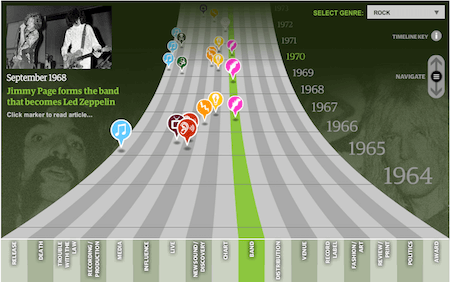
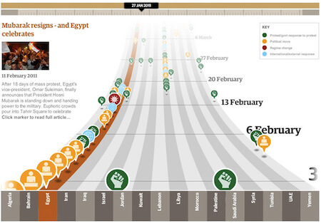
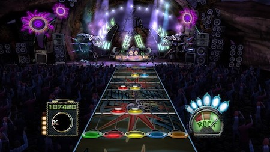

# time-vis

A collection of visuals that represent time

## The Museum of the World

[https://britishmuseum.withgoogle.com/](https://britishmuseum.withgoogle.com/)

Discover objects from the British Museum’s collection from prehistory to the present. This amazing interactive is created using WebGL. Screenshot doesn't do a justice, check out the actual page.

#### Similar visuals:

[Guardian's Music Timeline](https://www.theguardian.com/music/interactive/2011/jun/11/history-modern-music-timeline) (requires Flash player 😞)

[Guardian's Arab Spring - The Path of Protest](https://www.theguardian.com/world/interactive/2011/mar/22/middle-east-protest-interactive-timeline) (requires Flash player 😞)

[Guitar Hero](https://www.guitarhero.com/)

