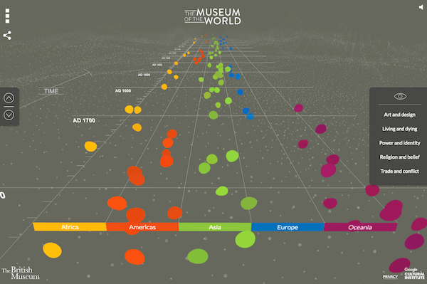
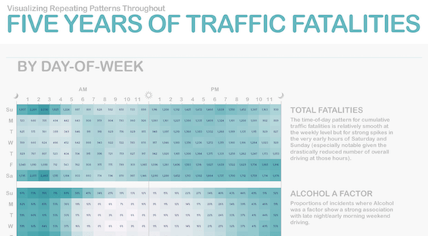

# time-vis

A collection of visuals that represent time

## The Museum of the World

[https://britishmuseum.withgoogle.com/](https://britishmuseum.withgoogle.com/)

Discover objects from the British Museum’s collection from prehistory to the present. This amazing interactive is created using WebGL. Screenshot doesn't do a justice, check out the actual page.

#### Similar visuals:

[Guardian's Music Timeline](https://www.theguardian.com/music/interactive/2011/jun/11/history-modern-music-timeline) (requires Flash player 😞)

 

[Guardian's Arab Spring - The Path of Protest](https://www.theguardian.com/world/interactive/2011/mar/22/middle-east-protest-interactive-timeline) (requires Flash player 😞)

 

[Guitar Hero](https://www.guitarhero.com/)

-----

## Histography

[http://histography.io/](http://histography.io/)

“Histography" is interactive timeline that spans across 14 billion years of history, from the Big Bang to 2015. The site draws historical events from Wikipedia and self-updates daily with new recorded events. Interactive visual uses [Pixijs](https://github.com/pixijs/pixi.js) on top of WebGL.

-----

## Five Years of Traffic Fatalities

https://io9.gizmodo.com/5970486/visualizing-5-years-of-traffic-fatalities-what-is-the-deadliest-time-to-drive

Five years of traffic fatalities across the United States visualized on a Calendar Heatmap.

#### Similar visuals:

[Flowingdata: Calendar of Fatal Crashes](http://flowingdata.com/2012/01/11/vehicles-involved-in-fatal-crashes/)

 

[Github User Contribution Activity](https://github.com/mbostock)

 

[D3 Calendar](https://bl.ocks.org/mbostock/4063318)

-----

## Mountains out of Molehills

http://www.informationisbeautiful.net/visualizations/mountains-out-of-molehills/

Normally, area chart + overlapping metrics + 3D space is the perfect recipe for a disaster. Except, it isn't in this visual. This interactive visual delivers the message clearly without any interaction. Neat colors, meaningful interactive options and positioning in (surprise!) 3D space makes this visual great.

